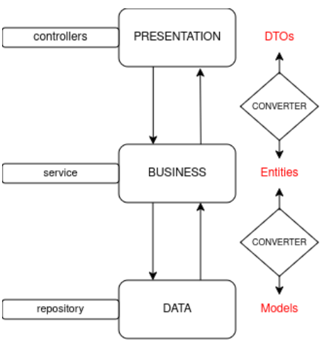
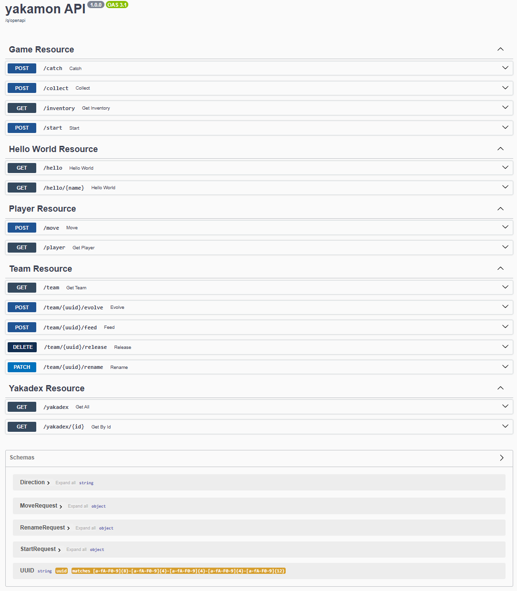

# 🐲 Yakamon - Quarkus REST Backend API

> **Showcase Repository:** To comply with EPITA's anti-plagiarism regulations, the raw source code of this backend project is kept private. This repository serves as an architectural showcase documenting the API design, ORM modeling, and core business logic.

## 📖 Project Context

**Yakamon** is an advanced backend development project from EPITA. The goal is to design a robust, scalable RESTful API using Java and the Quarkus framework to drive a 2D grid-based creature-collection game. The server acts as the absolute source of truth, managing player states, map traversal, inventory, and encounters while enforcing strict server-side rules.

## 🏗️ Strict Layered Architecture

The application enforces a strict N-Tier architecture to ensure modularity, separating the database models from the client payloads.

1. **Presentation Layer (Controllers/REST):** Exposes standard HTTP endpoints (`/player`, `/move`, `/yakadex`). Uses strict Data Transfer Objects (DTOs) for incoming requests and outgoing responses.
2. **Business Logic Layer (Services):** The core game engine. It calculates encounter probabilities, manages capture mechanics, and validates complex state-driven rules.
3. **Data Access Layer (Repositories):** Handles database persistence using Hibernate ORM, mapping Java Model objects directly to PostgreSQL tables.
4. **Data Converters:** An independent transformation layer ensuring that Entities, Models, and DTOs never bleed into the wrong architectural layer.

## 🚀 Key Technical Features & Business Logic

### 🗺️ Custom Map Parsing & Coordinate System
The game map is dynamically generated by parsing a custom Run-Length Encoding (RLE) format (e.g., `3GN1GS;1RY2WN1Rr`) into a 2D grid of `TileType` entities. The backend constantly tracks the player's `X` and `Y` coordinates, validating every move against grid boundaries.

### ⏱️ Server-Side Anti-Cheat & Tick-Based Cooldowns
To prevent clients from spamming actions (e.g., moving too fast or infinitely gathering resources), the backend enforces strict delays based on a server "tick" duration. The service calculates the time delta since the `lastMove` or `lastCatch` timestamps and blocks premature requests with a `429 Too Many Requests` status.

### 🔥 Advanced Walkability & Anti-Softlock Mechanisms
* **Elemental Traversal:** Players can walk on normally impassable terrain (Water, Lava, Mountain) if they have a Yakamon of the corresponding element (WATER, FIRE, ROCK) in their active team.
* **Release Safety (Anti-Softlock):** The backend implements strict validation to prevent a player from releasing a Yakamon if it is the only creature keeping them alive on a hazardous tile (e.g., attempting to release the only WATER Yakamon while standing on a Water tile).

## 🎯 API Documentation (Swagger)

The API endpoints are fully documented, strictly typed, and interactive via Swagger UI/OpenAPI.

## 🛠️ Technical Stack
* **Language/Framework:** Java, Quarkus
* **API Architecture:** REST (JAX-RS), OpenAPI / Swagger
* **Data Access:** Hibernate ORM, PostgreSQL
